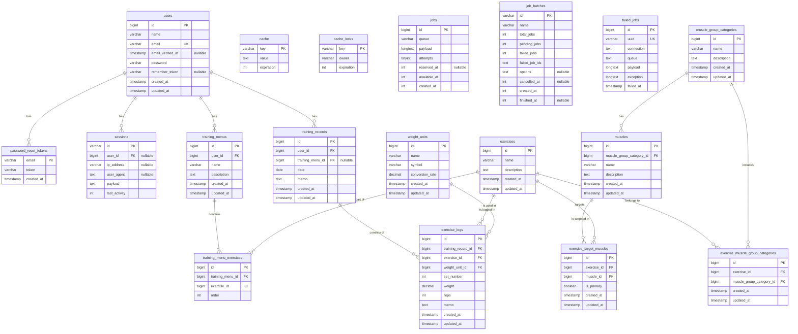

# データベース設計

```mermaid
erDiagram
    users {
        bigint id PK
        varchar name
        varchar email UK
        timestamp email_verified_at "nullable"
        varchar password
        varchar remember_token "nullable"
        timestamp created_at
        timestamp updated_at
    }

    password_reset_tokens {
        varchar email PK
        varchar token
        timestamp created_at
    }

    sessions {
        varchar id PK
        bigint user_id FK "nullable"
        varchar ip_address "nullable"
        text user_agent "nullable"
        text payload
        int last_activity
    }

    cache {
        varchar key PK
        text value
        int expiration
    }

    cache_locks {
        varchar key PK
        varchar owner
        int expiration
    }

    jobs {
        bigint id PK
        varchar queue
        longtext payload
        tinyint attempts
        int reserved_at "nullable"
        int available_at
        int created_at
    }

    job_batches {
        varchar id PK
        varchar name
        int total_jobs
        int pending_jobs
        int failed_jobs
        text failed_job_ids
        text options "nullable"
        int cancelled_at "nullable"
        int created_at
        int finished_at "nullable"
    }

    failed_jobs {
        bigint id PK
        varchar uuid UK
        text connection
        text queue
        longtext payload
        longtext exception
        timestamp failed_at
    }

    training_menus {
        bigint id PK
        bigint user_id FK
        varchar name
        text description
        timestamp created_at
        timestamp updated_at
    }

    exercises {
        bigint id PK
        varchar name
        text description
        timestamp created_at
        timestamp updated_at
    }

    muscle_group_categories {
        bigint id PK
        varchar name
        text description
        timestamp created_at
        timestamp updated_at
    }

    muscles {
        bigint id PK
        bigint muscle_group_category_id FK
        varchar name
        text description
        timestamp created_at
        timestamp updated_at
    }

    exercise_target_muscles {
        bigint id PK
        bigint exercise_id FK
        bigint muscle_id FK
        boolean is_primary
        timestamp created_at
        timestamp updated_at
    }

    exercise_muscle_group_categories {
        bigint id PK
        bigint exercise_id FK
        bigint muscle_group_category_id FK
        timestamp created_at
        timestamp updated_at
    }

    training_menu_exercises {
        bigint id PK
        bigint training_menu_id FK
        bigint exercise_id FK
        int order
    }

    training_records {
        bigint id PK
        bigint user_id FK
        bigint training_menu_id FK "nullable"
        date date
        text memo
        timestamp created_at
        timestamp updated_at
    }

    weight_units {
        bigint id PK
        varchar name
        varchar symbol
        decimal conversion_rate
        timestamp created_at
        timestamp updated_at
    }

    exercise_logs {
        bigint id PK
        bigint training_record_id FK
        bigint exercise_id FK
        bigint weight_unit_id FK
        int set_number
        decimal weight
        int reps
        text memo
        timestamp created_at
        timestamp updated_at
    }

    users ||--o{ password_reset_tokens : "has"
    users ||--o{ sessions : "has"
    users ||--o{ training_menus : "has"
    users ||--o{ training_records : "has"
    training_menus ||--|{ training_menu_exercises : "contains"
    exercises ||--|{ training_menu_exercises : "is part of"
    training_records ||--o{ exercise_logs : "consists of"
    exercises ||--o{ exercise_logs : "is logged in"
    weight_units ||--o{ exercise_logs : "is used in"
    muscle_group_categories ||--o{ muscles : "has"
    muscles ||--o{ exercise_target_muscles : "is targeted in"
    exercises ||--o{ exercise_target_muscles : "targets"
    exercises ||--o{ exercise_muscle_group_categories : "belongs to"
    muscle_group_categories ||--o{ exercise_muscle_group_categories : "includes"
```